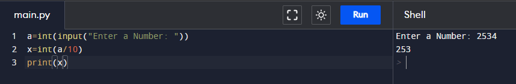
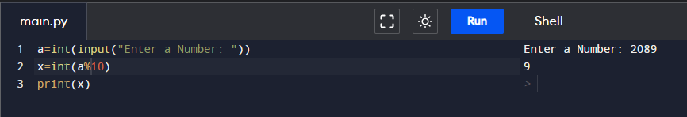
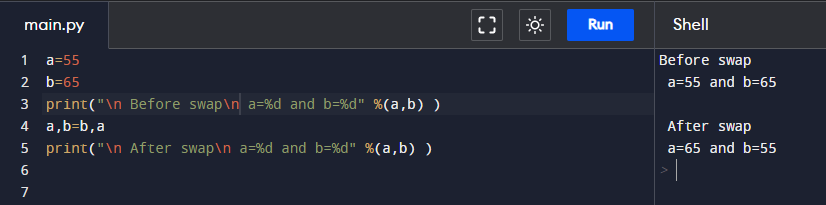
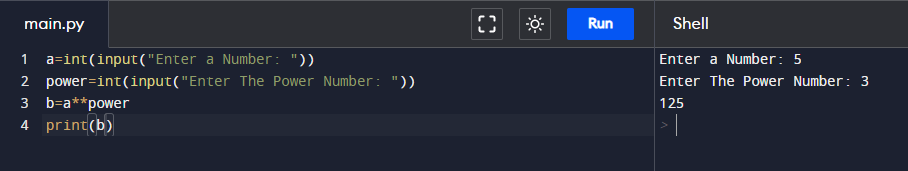
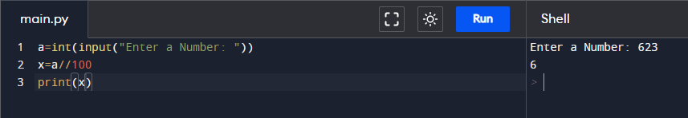
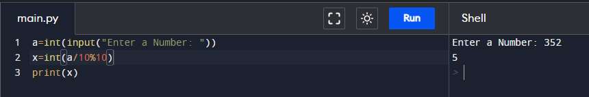
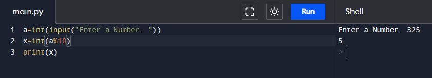
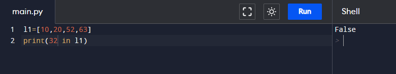
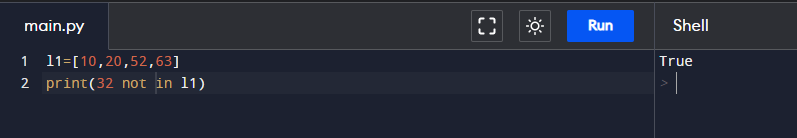
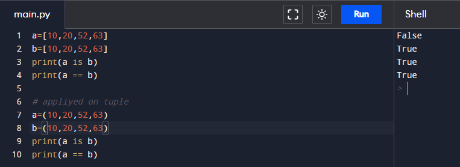

# Assignment - 5 Full Stack Web Development using Python MySirG Operators

    Qns 1. Write a python script to remove the last digit from a given number. (for example, if user enters 2534 then your output should be 253).

    Ans. 

    Qns 2. Write a python script to get the last digit from a given number. (for example, if user enters 2089 then your output should be 9).

    Ans.

    Qns 3. Write a python script to swap data of two variables.

    Ans.

    Qns 4. Write a python script to find x power y, where values of x and y are given by user.

    Ans.

    Qns 5. Write a python script which takes a three digit number from the user and displays only its first digit.

    Ans.

    Qns 6. Write a python script which takes a three digit number from the user and displays only its middle digit.

    Ans.

    Qns 7. Write a python script which takes a three digit number from the user and displays only its last digit.

    Ans.

    Qns 8. Write a python script to use IN operator to display the data present in the list.

    Ans.

    Qns 9. Write a python script to use NOT IN operator to display the data not present in list.

    Ans.

    Qns 10. Write a python script to use IS operator to display if both variables are the same object or not?

    Ans.
